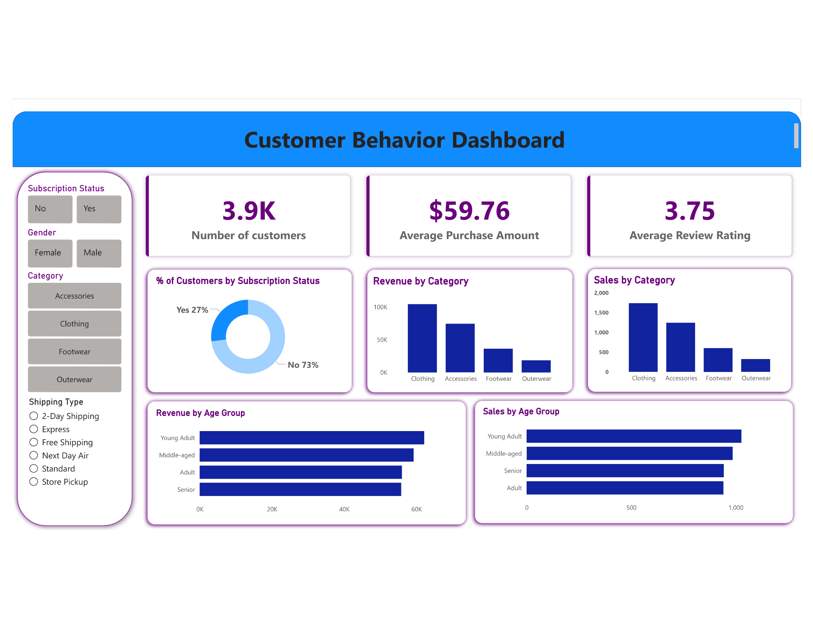

# 🛍️ Customer Shopping Behavior Analytics — End-to-End Data Analytics Project

> An end-to-end analytics project analyzing **3,900 customer shopping records** using **PostgreSQL**, **Python**, and **Power BI** — uncovering purchasing patterns, subscription dynamics, category-level revenue performance, and demographic-driven insights to support retail strategy and customer retention decisions.


---

## 📌 Table of Contents

- [Problem Statement](#-problem-statement)
- [Business Questions](#-business-questions)
- [Project Architecture](#-project-architecture--workflow)
- [Dashboard Preview](#-dashboard-preview)
- [Dataset Description](#-dataset-description)
- [Key KPIs](#-key-kpis)
- [Key Insights](#-key-insights)
- [SQL Analysis](#-sql-analysis)
- [Python Processing](#-python-processing)
- [Tech Stack](#️-tech-stack)
- [Project Structure](#-project-structure)
- [How to Use](#-how-to-use)
- [Author](#-author)

---

## 🎯 Problem Statement

Retail businesses collect vast amounts of customer transaction data but often lack the analytical infrastructure to convert it into revenue strategy. Key questions — *who is buying, what they buy, how much they spend, and whether they'll return* — frequently go unanswered.

This project builds a complete analytics pipeline to address that gap: raw shopping data is extracted and queried in **PostgreSQL**, validated and processed in **Python**, and visualized in an interactive **Power BI** dashboard — enabling business stakeholders to make data-driven decisions on subscriptions, category investment, and customer segmentation without requiring technical skills.

---

## ❓ Business Questions

This analysis was structured around 10 targeted business questions:

| # | Business Question | Analytical Method |
|---|---|---|
| 1 | What is the total revenue generated by male vs. female customers? | SQL `GROUP BY` + `SUM()` |
| 2 | Which customers used a discount but still spent above average? | SQL subquery with conditional filter |
| 3 | Which are the top 5 products by average review rating? | SQL `AVG()` + `ORDER BY` |
| 4 | Does shipping type (Standard vs. Express) affect average spend? | SQL `AVG()` comparison |
| 5 | Do subscribed customers spend more than non-subscribers? | SQL `GROUP BY` aggregation |
| 6 | Which 5 products have the highest discount application rate? | SQL `CASE WHEN` + percentage calculation |
| 7 | What is the distribution of New, Returning, and Loyal customers? | SQL CTE + `CASE WHEN` segmentation |
| 8 | What are the top 3 products per category? | SQL Window Function `ROW_NUMBER() OVER()` |
| 9 | Are repeat buyers (>5 purchases) more likely to subscribe? | SQL filter + `GROUP BY` |
| 10 | What is the revenue contribution by age group? | SQL `GROUP BY` age band |

---

## 🏗️ Project Architecture & Workflow

```
┌─────────────────┐     ┌──────────────────┐     ┌─────────────────────┐     ┌──────────────────┐
│   📄 Raw Data    │────▶│  🐘 PostgreSQL   │────▶│  🐍 Python          │────▶│  📊 Power BI     │
│   (Excel/CSV)   │     │  SQL Querying    │     │  Jupyter Notebook   │     │  Dashboard       │
│                 │     │  Data Storage    │     │  pandas / numpy     │     │  Interactive     │
│  3,900 records  │     │  10 SQL queries  │     │  Cleaning & EDA     │     │  Visualization   │
│  18 columns     │     │  CTEs, Windows   │     │  Validation         │     │  KPIs + Charts   │
└─────────────────┘     └──────────────────┘     └─────────────────────┘     └──────────────────┘
```

**Step-by-step pipeline:**

1. **Ingestion** — Raw CSV (3,900 rows × 18 columns) imported into PostgreSQL as the `customer` table
2. **SQL Analysis** — 10 business questions answered via structured SQL queries (aggregations, CTEs, window functions)
3. **Python Validation** — Query outputs verified using `pandas`; data cleaned, null-handled (37 missing review ratings), and enriched with derived columns (age group, customer segment)
4. **Power BI Visualization** — Cleaned data loaded into Power BI; interactive dashboard built with KPI cards, slicers, and cross-filtering visuals
5. **Reporting** — Findings documented in a structured PDF analysis report

---

## 📊 Dashboard Preview



> **Live Dashboard Controls:**
> Filter by **Subscription Status** (Yes/No), **Gender** (Male/Female), **Category** (Clothing/Accessories/Footwear/Outerwear), and **Shipping Type** (6 options) — all slicers cross-filter every visual in real-time.

---

## 🗂️ Dataset Description

| Column | Description | Type | Sample |
|---|---|---|---|
| `Customer ID` | Unique customer identifier | Integer | 1, 2, 3 |
| `Age` | Customer age | Integer | 19–70 |
| `Gender` | Male / Female | Categorical | Male |
| `Item Purchased` | Specific product name | Categorical | Blouse, Jeans, Jacket |
| `Category` | Product category | Categorical | Clothing, Accessories |
| `Purchase Amount (USD)` | Transaction value in USD | Integer | $20–$100 |
| `Location` | US state of customer | Categorical | Kentucky, Maine |
| `Size` | Product size | Categorical | S, M, L, XL |
| `Color` | Product color | Categorical | Gray, Maroon |
| `Season` | Season of purchase | Categorical | Fall, Spring, Winter, Summer |
| `Review Rating` | Customer rating (1–5) | Float | 3.1, 4.2 *(37 nulls)* |
| `Subscription Status` | Active subscription (Yes/No) | Boolean | Yes |
| `Shipping Type` | Delivery method | Categorical | Express, Standard, Free Shipping |
| `Discount Applied` | Whether discount was used | Boolean | Yes / No |
| `Promo Code Used` | Whether promo code applied | Boolean | Yes / No |
| `Previous Purchases` | Count of prior transactions | Integer | 0–50 |
| `Payment Method` | Payment instrument | Categorical | PayPal, Credit Card, Cash |
| `Frequency of Purchases` | Self-reported purchase frequency | Categorical | Weekly, Fortnightly |

**Dataset Summary:**
- **Rows:** 3,900 | **Columns:** 18 | **Null values:** 37 (Review Rating only)
- **Date source:** Excel/CSV → PostgreSQL `customer` table
- **Revenue range:** $20–$100 per transaction | **Total:** $233,081

---

## 📈 Key KPIs

| KPI | Value | Context |
|---|---|---|
| 👥 Total Customers | **3,900** | Complete dataset — no duplicates |
| 💰 Total Revenue | **$233,081** | Sum of all purchase amounts |
| 🧾 Avg Purchase Amount | **$59.76** | Consistent across gender and shipping type |
| ⭐ Avg Review Rating | **3.75 / 5** | Moderate satisfaction; 37 ratings missing |

---

## 💡 Key Insights

### 🔴 Subscription & Retention Gap

**1. Only 27% of customers hold an active subscription — yet subscriber spend is nearly identical ($59.49) to non-subscribers ($59.87).** This means the current subscription model is not creating a meaningful spend premium. The untapped 73% non-subscriber base represents the single largest revenue unlock: converting even 10% to subscribers would add ~285 new recurring customers. **Recommendation:** Introduce subscription-exclusive perks (early access, free shipping upgrades) that create spend differentiation, not just loyalty labels.

**2. 79.9% of customers (3,116) qualify as Loyal** (>10 previous purchases), yet 73% are still non-subscribers. This is a critical misalignment — the store has a highly engaged repeat customer base that has not been converted into formal subscription relationships. **Recommendation:** Target the Loyal non-subscriber segment with a personalized re-engagement campaign as the highest-ROI retention investment.

### 🟡 Category & Product Performance

**3. Clothing dominates at $104,264 (44.7% of total revenue) with 1,737 transactions** — nearly 1.4× the revenue of Accessories ($74,200) despite being 1.4× the transaction count. The top 5 individual products by revenue (Blouse, Shirt, Dress, Pants, Jewelry) are all in the $10,000+ band, confirming clothing as the core catalog anchor. **Recommendation:** Prioritize Clothing for seasonal promotions, inventory depth, and upsell pairing with Accessories.

**4. Outerwear underperforms significantly at $18,524 (8.0% of revenue) across just 324 transactions** — the smallest category by both revenue and volume. With an average purchase of $57.17 (lowest of all categories), Outerwear may be priced below customer willingness-to-pay. **Recommendation:** Test a price architecture review for Outerwear with a 10–15% premium tier to improve category margin.

### 🟢 Demographic & Seasonal Insights

**5. Middle-aged customers (35–55) generate the highest revenue at $88,853 (38.1% of total)** across 1,482 transactions — nearly double the Young Adult segment. Yet the Young Adult cohort has the highest average purchase of $60.65, suggesting higher spend-per-visit despite lower overall volume. **Recommendation:** Middle-aged customers warrant retention focus; Young Adults warrant acquisition investment given their per-visit spend premium.

**6. Fall drives the highest seasonal revenue at $60,018** — 7.6% more than the lowest season (Summer at $55,777). The relatively even seasonal distribution (~25% each) indicates no severe demand cliffs, but Fall and Spring together account for 51% of annual revenue. **Recommendation:** Front-load marketing budget to August–September (pre-Fall) and February–March (pre-Spring) for maximum seasonal ROI.

**7. Discount application does not increase average spend** — discounted purchases average $59.28 vs. $60.13 for non-discounted. Discounts are being given without incremental revenue return. **Recommendation:** Audit discount strategy — shift from blanket discounts to conditional ones (e.g., "spend $80 to unlock 15% off") to preserve margin while driving basket size.

---

## 🛠️ Tech Stack

| Tool | Version | Purpose |
|---|---|---|
| **PostgreSQL** | 14+ | Data storage, SQL querying, business question analysis |
| **Python** | 3.9+ | Data cleaning, validation, EDA, derived feature engineering |
| **pandas** | 1.5+ | DataFrame operations, null handling, aggregation validation |
| **numpy** | 1.23+ | Numerical operations and array-based transformations |
| **Jupyter Notebook** | 6.5+ | Interactive Python development and documentation |
| **Microsoft Power BI Desktop** | Latest | Interactive dashboard, KPI cards, slicer-driven filtering |
| **Excel / CSV** | — | Raw data source (3,900 records × 18 columns) |

---

## 📁 Project Structure

```
customer-behavior-analytics/
│
├── 📄 README.md                              ← You are here
│
├── 📂 images/
│   └── Dashboard_Screenshot.png             ← Dashboard preview (embedded above)
│
├── 📂 sql/
│   ├── customer_shopping_queries.sql         ← All 10 SQL queries with comments
│   └── README_sql.md                         ← Query index and descriptions
│
├── 📂 notebooks/
│   └── Customer_shopping_behaviour.ipynb    ← Data cleaning, EDA, validation
│
├── 📂 dashboard/
│   └── customer_shopping_behavior_Dashboard.pbix  ← Power BI file
│
├── 📂 reports/
│   └── Analysis_Report.pdf                  ← Full business analysis report
│
└── 📂 data/
    └── customer_shopping_behavior.csv        ← Raw dataset (3,900 rows × 18 cols)
```

---

## 🚀 How to Use

### For Recruiters & Hiring Managers
Start with the **dashboard screenshot** above, then explore deeper:

1. 📊 **Power BI Dashboard** → Download `dashboard/customer_shopping_behavior_Dashboard.pbix` → Open in [Power BI Desktop](https://powerbi.microsoft.com/desktop/) (free)
2. 📋 **Full Report** → Read `reports/Analysis_Report.pdf` for methodology and written insights
3. 🗄️ **SQL Queries** → Browse `sql/customer_shopping_queries.sql` to review analytical SQL
4. 🐍 **Python Notebook** → Open `notebooks/Customer_shopping_behaviour.ipynb` in Jupyter or VS Code

### For Technical Review

```bash
# 1. Clone the repository
git clone https://github.com/YOUR_USERNAME/customer-behavior-analytics.git
cd customer-behavior-analytics

# 2. Set up Python environment
pip install pandas numpy jupyter

# 3. Launch the notebook
jupyter notebook notebooks/Customer_shopping_behaviour.ipynb

# 4. Load data into PostgreSQL (optional)
psql -U your_username -d your_database \
  -c "\copy customer FROM 'data/customer_shopping_behavior.csv' CSV HEADER"

# 5. Run SQL queries
psql -U your_username -d your_database \
  -f sql/customer_shopping_queries.sql

# 6. Open Power BI file
# File → Open → dashboard/customer_shopping_behavior_Dashboard.pbix
```

---

## 📄 License

This project is licensed under the MIT License — see [LICENSE](LICENSE) for details.

---

## 👤 Author

**ARSHAD K I SHAIKH**
*Data Analyst | SQL · Python · Power BI · PostgreSQL*

[](https://linkedin.com/in/arshadkishaikh/)
[](https://github.com/Arshadkishaikh)

---

> 💼 *This project demonstrates a complete end-to-end data analytics workflow: SQL querying in PostgreSQL, data validation and feature engineering in Python, and business-insight-driven interactive dashboard design in Power BI — applied to a real 3,900-record retail dataset.*

> ⭐ If this project helped or inspired you, please give it a star!
